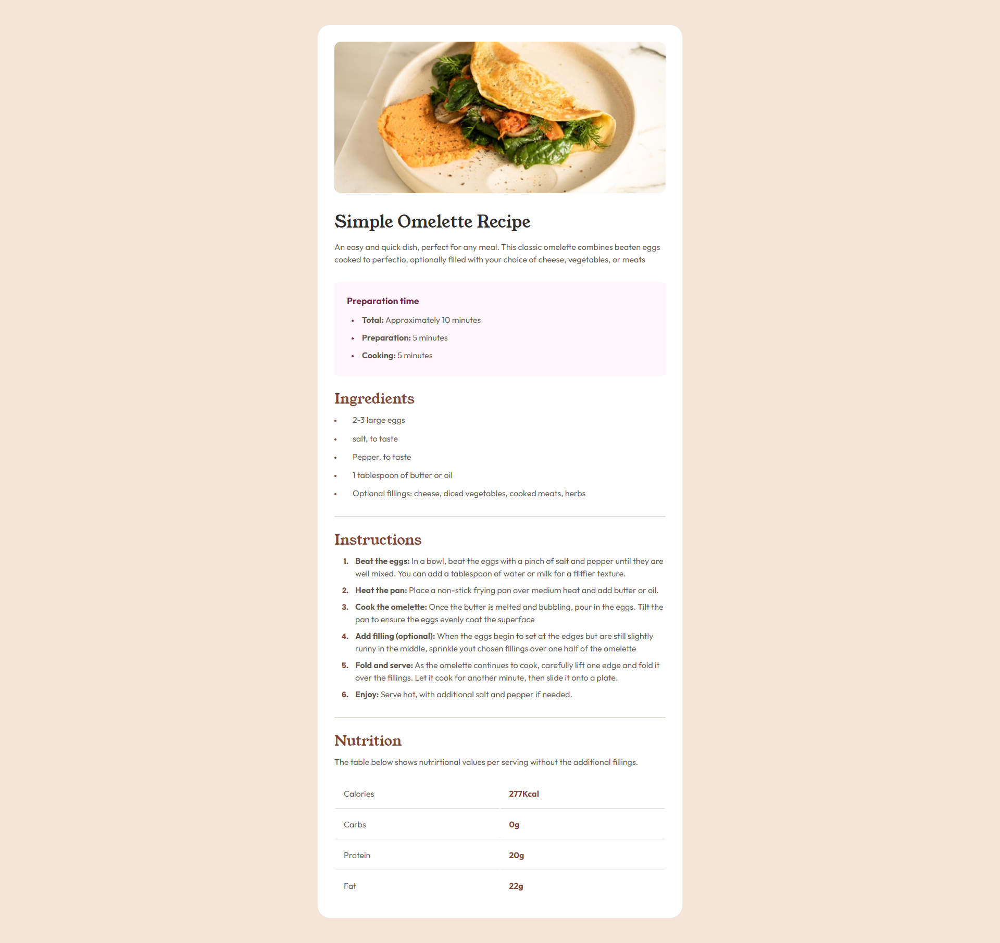

# Frontend Mentor - Recipe page solution

This is a solution to the [Recipe page challenge on Frontend Mentor](https://www.frontendmentor.io/challenges/recipe-page-KiTsR8QQKm). Frontend Mentor challenges help you improve your coding skills by building realistic projects. 

## Table of contents

- [Overview](#overview)
  - [The challenge](#the-challenge)
  - [Screenshot](#screenshot)
  - [Links](#links)
- [My process](#my-process)
  - [Built with](#built-with)
  - [What I learned](#what-i-learned)
  - [Continued development](#continued-development)
  - [Useful resources](#useful-resources)
- [Author](#author)

## Overview

### Screenshot



### Links

- Solution URL: [GitHub Repo](https://github.com/AlexanderTejedor/Recipe-page)
- Live Site URL: [GitHub Pages](https://alexandertejedor.github.io/Recipe-page/)

## My process

### Built with

- Semantic HTML5 markup
- CSS custom properties
- Flexbox
- Mobile-first workflow

### What I learned

In this challenge, I learned to manage tables. I had never used the table tag on other occasions, but in this challenge, I had the opportunity, so I had to look at the documentation about the <table> tag and its components several times. It was a very pleasant experience.

I also worked with semantic HTML, so I became familiar again with the concept of the correct structure in HTML documents. I even implemented it, and I am aware that it can be improved.

```html
<table class="nutrition-table">
                <tbody class="table-container">
                    <tr class="row">
                        <td class="td property">Calories</td>
                        <td class="td value">277Kcal</td>
                    </tr>
                    <tr class="row">
                        <td class="td property">Carbs</td>
                        <td class="td value">0g</td>
                    </tr>
                    <tr class="row">
                        <td class="td property">Protein</td>
                        <td class="td value">20g</td>
                    </tr>
                    <tr class="row">
                        <td class="td property">Fat</td>
                        <td class="td value">22g</td>
                    </tr>
                </tbody>
            </table>
```
### Continued development

Now that I have finished this challenge, I want to continue working on basic projects until I have enough confidence to tackle more advanced ones. I am reinforcing my knowledge with JavaScript, so soon I will venture into doing the best challenges.

### Useful resources

- [Google Fonts](https://fonts.google.com/) - This helped me to use external fonts instead of local ones, so that everyone can identify the type of font I used for this challenge.
- [mdn web docs](https://developer.mozilla.org/es/docs/Web/CSS/::marker) - This page is very good for finding documentation. In fact, I used it a lot. At this moment, I used it to learn how to change the styles of <ol> and <ul> lists. It was quite useful in this challenge.
- [nekpCalc](https://nekocalc.com/es/px-a-rem-conversor) - I used this page to support me with relative measurements like rem. I used it as a reference to use the rem measurement in my project and improve the challenge.

## Author

- Website - [Alexander Tejedor](https://github.com/AlexanderTejedor)
- Frontend Mentor - [@AlexanderTejedor](https://www.frontendmentor.io/profile/AlexanderTejedor)
- Twitter - [@Alexand59894016](https://x.com/Alexand59894016)
